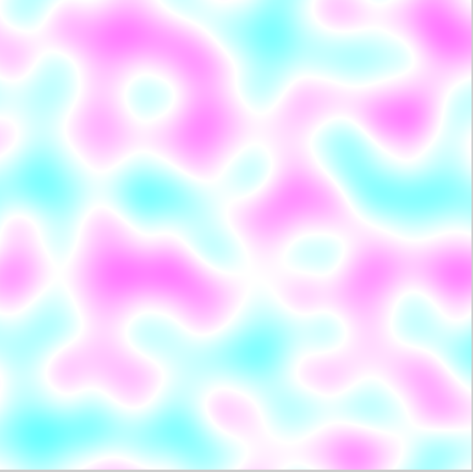

# Perlin Noise Algorithm

This is a simple implementation of a Perlin Noise algorithm, made to accompany the written report for the advanced algorithms project.

## Description

An in-depth paragraph about your project and overview of use.

## Executing program

* Both programs can be run with standard debug commands
* Example:
```
./noiseTest
```
* The noiseTest program generates a noise grid based on your specifications and then will continualy accept pairs of coordinates and return the noise value at that point (exit using ctrl+C)
* The noiseSDL program accepts a width, height, and draw scale, and then displays a popup window visualizing the noise function for 5 seconds. Note: may require SDL to be installed in order to run, I'm not sure (this was my first time ever using SDL)
* Example:



## Authors

Adrian Spinali
